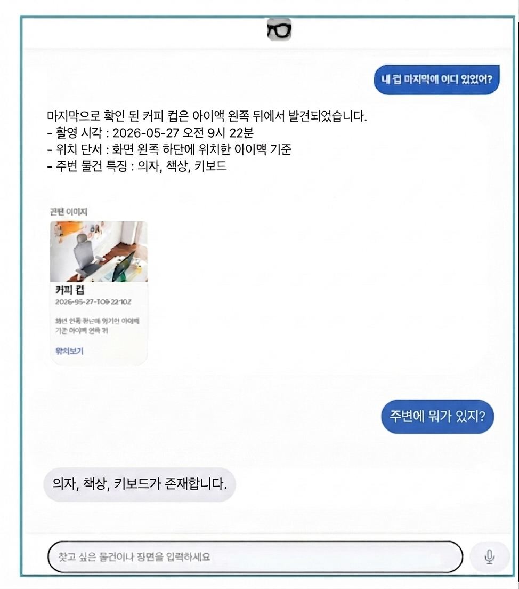
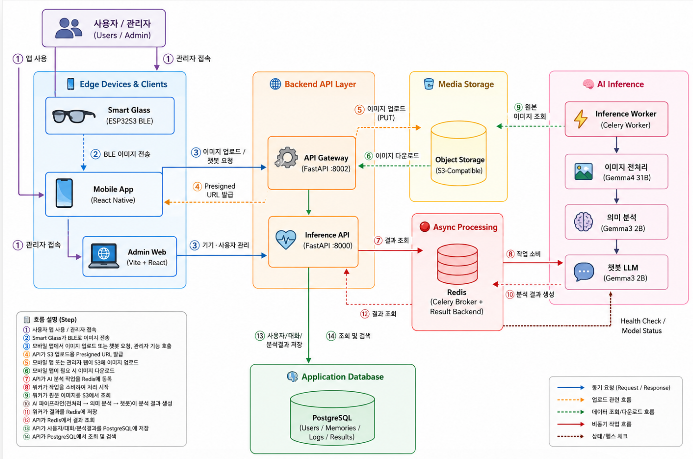
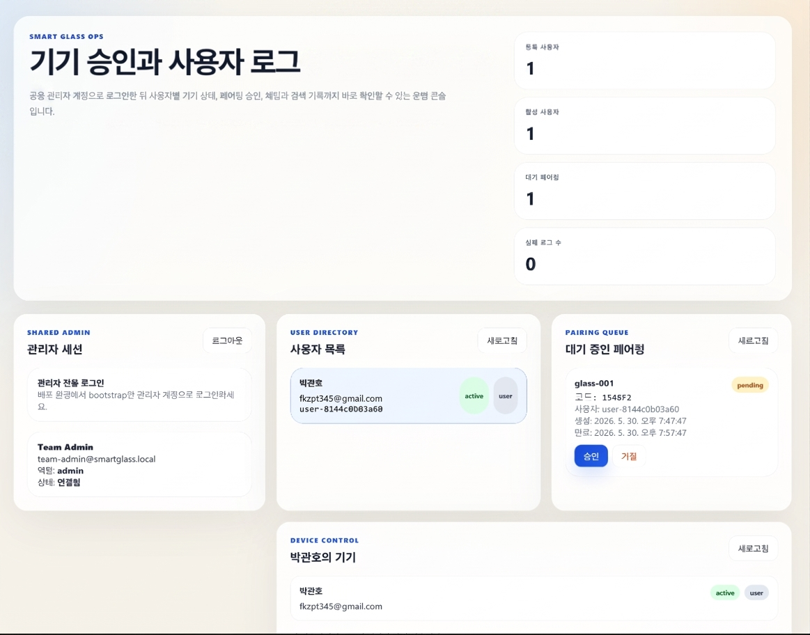

# Smart Memory (Smart Glass Project)

A wearable cognitive assistant system leveraging Vision-Language Models (VLM) and Large Language Models (LLM) to recover daily visual memories and locate misplaced personal items.

This repository contains the monorepo for the Smart Memory project, which encompasses a mobile/smart-glass client, an asynchronous VLM inference pipeline, and an API gateway for metadata search and chat interfaces.

## 1. Project Overview



Modern individuals frequently experience cognitive overload, leading to misplaced items (e.g., wallets, glasses, keys). Smart Memory provides a continuous visual logging solution using a smart-glass form factor. 

To overcome the hardware limitations of wearable devices (such as battery life and thermal constraints), this project implements an optimized edge-to-cloud architecture:
*   **Lightweight Capture Client:** The smart-glass client uploads images directly to Object Storage via Presigned URLs, bypassing the backend to eliminate server bottlenecks.
*   **Asynchronous VLM Processing:** A Celery and Redis-backed inference worker asynchronously processes images using Vision-Language Models (`gemma4:31b-cloud` or `Qwen2.5-VL`) to extract structured metadata (detected objects, contextual captions, spatial hints, and confidence scores).
*   **Multi-modal Retrieval:** When a user submits a natural language query (e.g., "Where did I leave my earphones?"), the system expands the query with an LLM-aware intent pipeline and performs weighted lexical retrieval over PostgreSQL JSONB memory records. It then synthesizes a grounded natural language response using an LLM (`gemma3:4b-cloud`) and returns the related snapshot image.

## 2. Key Features

*   **Direct S3 Upload Mechanism:** Utilizes Presigned URLs to prevent credential exposure and offload binary transfer overhead from the API server.
*   **Asynchronous Distributed Pipeline:** Employs a Celery/Redis task queue to prevent blocking the API gateway during heavy VLM inference operations.
*   **Metadata-Image Co-Mapping Search:** Stores visual metadata and image references together, then retrieves memories with weighted scoring across object names, tags, location hints, captions, and scene summaries.
*   **3-stage LLM Search Pipeline:** Separates chat into intent extraction, VLM-aware query expansion, and grounded response generation so answers are based on retrieved memory records rather than free-form guessing.
*   **Conversational UI with Fallback:** Provides a natural language chat interface with a rule-based template fallback path when external LLM APIs fail or return unusable answers.
*   **Unified Monorepo Structure:** Consolidates frontend, backend, AI models, and infrastructure management into a single repository for efficient continuous integration.

## 3. AI Pipeline Evaluation Plan

The repository includes lightweight experiment utilities under `docs/experiments/`.

```bash
python docs/experiments/evaluate_portfolio_results.py
```

The current repository includes two evaluation utilities:

- `evaluate_portfolio_results.py`: smoke-checks existing `ai_test2/` artifacts.
- `evaluate_sample_data_vlm.py`: runs VLM extraction over existing `sample_data`
  images with filename-derived weak labels.

The first sample-data run used 10 existing images (`wallet_*` 5 + `key_*` 5).
This is a preliminary weak-label benchmark, not a final manually labeled test.

| Metric | Result |
|---|---:|
| Evaluated images | 10 |
| Successful VLM outputs | 10 / 10 |
| Overall weak-label recall | 50.0% |
| Wallet weak-label recall | 80.0% |
| Key weak-label recall | 20.0% |
| Average VLM latency | 27.216 sec |

The results suggest that wallet-like objects are detected more reliably than
small key-like objects in the current VLM prompt/output path. A larger 100-image
run and manual labels should replace these preliminary values before treating
them as final performance numbers.

Planned evaluation:

| Area | Metric |
|---|---|
| VLM extraction | object precision/recall against manually labeled images |
| Spatial memory | surface / position-hint / nearby-object correctness |
| Multi-pass prompting | single-pass vs. multi-pass ablation |
| Retrieval | Top-k hit rate for natural-language item queries |
| Answering | grounded answer correctness and citation validity |
| Runtime | inference latency and end-to-end query latency |

The measured sample artifacts were generated through the Ollama/Gemma path
(`gemma4:31b-cloud`), while the repository also includes a separate Qwen2.5-VL
multi-stage inference implementation for local/server-side deployment.

## 4. System Architecture



The architecture is systematically divided into three main layers:

1.  **View Layer:**
    *   `smart-glass-client`: React Native (Expo) app and smart-glass simulator for image capture and chat.
    *   `admin-web`: React/Vite dashboard for system monitoring and latency statistics.
    
    *Admin Dashboard Preview:*
    
2.  **Controller Layer:**
    *   `api-server`: FastAPI-based gateway for handling authorization, Presigned URL issuance, search routing, and PostgreSQL memory persistence.
3.  **Model Layer:**
    *   `inference-server`: Celery worker node dedicated to VLM image analysis.
    *   `LLM Engine`: Cloud-based LLM APIs utilized for generating natural language feedback.

## 5. Repository Layout

```text
smart-glass-project/
|-- apps/
|   |-- api-server/         # FastAPI gateway (Auth, DB, Search, Chat)
|   |-- inference-server/   # Celery worker (VLM async image analysis)
|   |-- admin-web/          # React/Vite web dashboard
|   `-- smart-glass-client/ # React Native mobile app & firmware sketches
|-- packages/               # Shared TS/JS libraries
|   |-- shared-types/       
|   |-- shared-utils/       
|   |-- shared-config/      
|   `-- ui-kit/             
|-- infra/                  # Infrastructure configurations
|   |-- compose/            # Docker Compose files (local & prod)
|   |-- docker/             # Dockerfiles
|   |-- k8s/                # Kubernetes deployment manifests
|   |-- nginx/              # Reverse proxy configurations
|   `-- terraform/          # IaC provisioning
|-- scripts/                # Automation and operational scripts
|-- docs/                   # System documentation and reports
`-- .github/                # GitHub Actions CI/CD workflows
```

## 6. Prerequisites

*   Docker and Docker Compose
*   Node.js (v22.22.2 recommended for client development)
*   Python 3.12 (for local backend development)
*   Object Storage Credentials (S3-compatible API, e.g., Naver Cloud Object Storage)

## 7. Local Development Environment

The recommended approach for local development is using Docker Compose at the repository root. This initiates `postgres`, `redis`, `api-server`, `inference-api`, and `inference-worker`.

### Environment Configuration
Copy the template configuration file:
```bash
cp .env.example .env
```
Ensure the following Object Storage variables are properly configured in your `.env` file (defaults are tuned for Naver Object Storage):
*   `STORAGE_ACCESS_KEY_ID`
*   `STORAGE_SECRET_ACCESS_KEY`
*   `STORAGE_BUCKET_NAME`
*   `STORAGE_REGION=kr-standard`
*   `STORAGE_ENDPOINT_URL=https://kr.object.ncloudstorage.com`
*   `STORAGE_ADDRESSING_STYLE=path`

### Running the Stack
```bash
docker compose -f infra/compose/docker-compose.local.yml up --build
```

### Important Notes
*   **WSL & DNS Issues:** If running under WSL, domain name resolution for the object storage may fail. To resolve this, disable the auto-generated `/etc/resolv.conf` and manually set standard nameservers (e.g., `8.8.8.8`, `1.1.1.1`).
*   **Postgres Volumes:** If the stack was previously executed with different Postgres credentials, the local `postgres-data` volume must be rebuilt before starting the updated compose stack.

### Makefile Utilities
The repository includes a `Makefile` for streamlined development operations:
*   `make bootstrap`: Initialize project environment.
*   `make dev`: Run local development scripts.
*   `make test`: Execute comprehensive test suites.
*   `make lint`: Run code linters.
*   `make smoke-inference-qwen`: Execute VLM smoke tests.

## 8. Production Deployment

The production compose stack delegates both VLM inference and chat responses to Ollama Cloud, allowing the inference worker to run on a standard CPU-only instance.

Configure the following variables in the root `.env`:
```env
API_LLM_OLLAMA_API_KEY=<your_api_key>
API_LLM_OLLAMA_BASE_URL=https://ollama.com/api
API_LLM_OLLAMA_MODEL=gemma3:4b-cloud
OLLAMA_VLM_MODEL=gemma4:31b-cloud
```

Launch the production environment:
```bash
docker compose -f infra/compose/docker-compose.prod.yml up --build -d
```
Once initialized, the public API gateway will be accessible on port `8002`.

## 9. CI/CD Pipeline

Continuous Integration is managed via GitHub Actions (`.github/workflows/ci.yml`). The pipeline currently enforces:
*   **Python Unit Tests:** Runs `unittest` suites for the `api-server` backend.
*   **TypeScript Validation:** Runs `tsc --noEmit` type checking for the `smart-glass-client`.
*   **Script Smoke Tests:** Verifies syntax compilation for critical operational scripts.

## 10. Contributors

*   **Smart Memory Team** - Kyonggi University (2026 Capstone Design)
    *   Seungyeop Kang (Team Leader, AI/VLM)
    *   Jisung Hong (Pipeline/Glass Hardware)
    *   Kwanho Park (Infrastructure/Inference)
    *   Yongbin Kim (Backend/Database)
    *   Junhwi Kim (Web/App)
    *   Seoyoung Ji (UI Design/Frontend)
